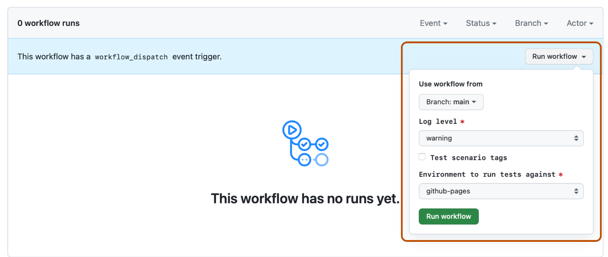

# Kafka Multi-Cloud Infrastructure as Code (IaC)

Este repositorio contiene la infraestructura unificada como código utilizando Terraform y GitHub Actions para desplegar y gestionar clsteres de Kafka en diferentes proveedores de nube de forma automatizada.

---

## Proveedores Soportados

| Proveedor | Servicio de Kafka | Variable (cloud_provider) |
| :--- | :--- | :--- |
| AWS | Amazon MSK (Managed Streaming for Apache Kafka) | aws |
| GCP | Google Kubernetes Engine (GKE) | gcp |
| Confluent | Confluent Cloud Dedicated Cluster | confluent |

---

## ¿Cómo elegir cuál desplegar?

Puedes indicar qué proveedor activar al ejecutar los comandos en la terminal utilizando la variable cloud_provider:

1. **Para desplegar en AWS:**
   ```bash
   terraform apply -var="cloud_provider=aws"
    ```

2. **Para desplegar en GCP:**
```bash
terraform apply -var="cloud_provider=gcp"

```


3. **Para desplegar en Confluent Cloud:**

Genera un API Key para tu cuenta de servicio en Confluent Cloud y luego ejecuta el comando de Terraform:

```bash

$ confluent kafka api-key create --service-account sa-123456 --resource lkc-abcdef 
+------------------------------------------------------------------+
| API Key    | LTA4XXXXXXXXXXXXXXXXXX                                           | API Secret | wJalrXUtnFEMI/K7MDENG/bPxRfiCYEXAMPLEKEY                           +------------------------------------------------------------------+
Saved API Key LTA4XXXXXXXXXXXXXXXXXX for service account sa-123456
```


```bash

$ terraform apply -var="cloud_provider=confluent"

```

---

## Automatización con GitHub Actions

También puedes realizar los despliegues de manera visual mediante la interfaz de GitHub Actions utilizando el menú desplegable interactivo (workflow_dispatch), seleccionando el proveedor deseado:


